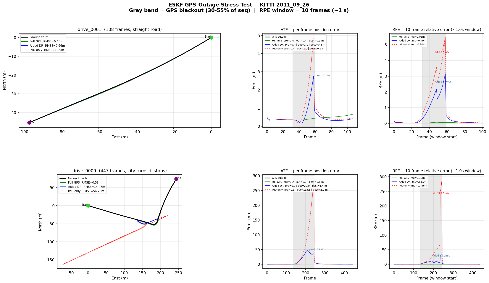
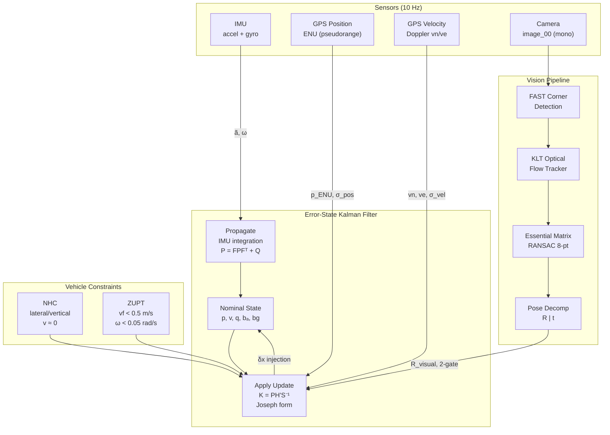
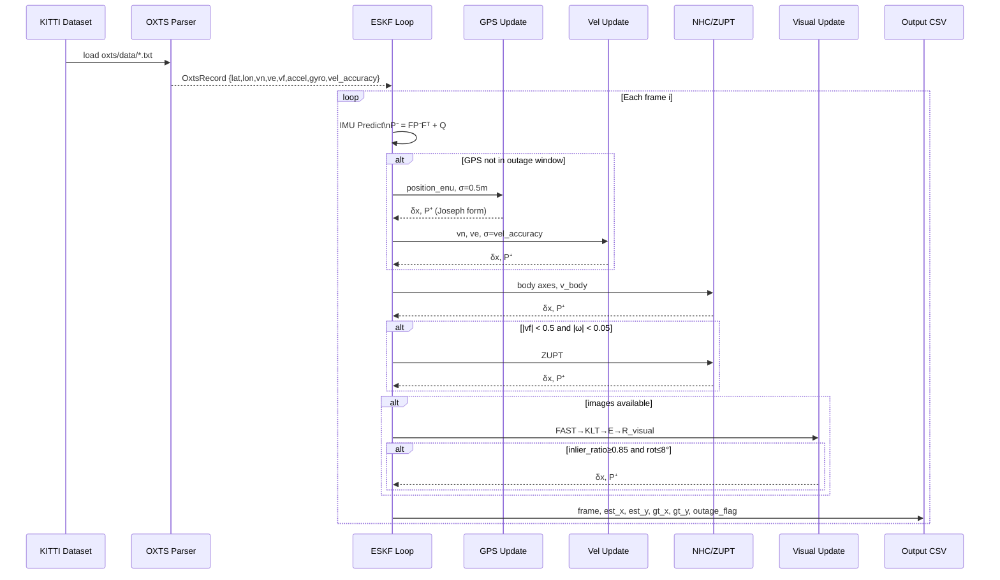
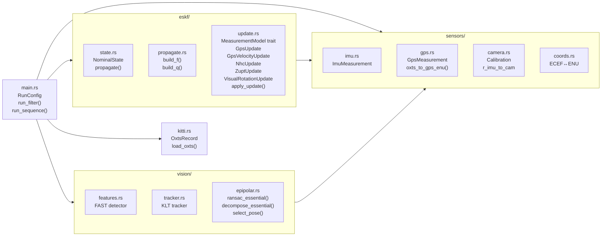

# ESKF — Error-State Kalman Filter in Rust

A multi-rate sensor-fusion pipeline built from scratch in Rust as a learning
project. It fuses IMU (Inertial Measurement Unit), GPS (Global Positioning
System) position and Doppler velocity, monocular camera, and vehicle-kinematic
constraints on the KITTI raw dataset.

---

## Goals

| Goal | Status |
|---|---|
| Implement a 15-DOF (Degrees of Freedom) ESKF in pure Rust (no filter library) | ✅ |
| Understand ESKF theory through implementation (state, propagation, update) | ✅ |
| Fuse GPS position + IMU on KITTI | ✅ |
| Add GPS Doppler velocity as an independent measurement | ✅ |
| Add monocular visual rotation from essential matrix | ✅ |
| Add Non-Holonomic Constraint (NHC) and ZUPT (Zero Velocity Update) vehicle constraints | ✅ |
| Use numerically stable Joseph-form covariance update | ✅ |
| Simulate GPS outage and measure per-phase / RPE (Relative Pose Error) degradation | ✅ |
| Visualise trajectories, ATE (Absolute Trajectory Error), and RPE with Python/matplotlib | ✅ |

---

## Results (KITTI 2011\_09\_26)

> All error figures are in metres. **RMSE** (Root Mean Square Error) measures
> average positional error over the full sequence; **peak error** is the
> worst-case single-frame displacement.

### Full GPS — all sensors

| Sequence | Frames | Full-GPS RMSE |
|---|---|---|
| drive\_0001 (straight road) | 108 | **0.45 m** |
| drive\_0009 (city turns + stops) | 447 | **0.58 m** |

### GPS-outage stress test (30–55 % of sequence blacked out)

| Run | drive\_0001 peak | drive\_0009 peak |
|---|---|---|
| IMU dead-reckoning (no aux) | 4.9 m | 290 m |
| Aided DR (Dead Reckoning) (NHC + ZUPT + Visual) | **2.8 m** | **47 m** |

The GPS Doppler velocity update was the single largest improvement:
full-GPS RMSE dropped from ~2.7 m → 0.45 m because it keeps the velocity
state tightly bounded between position fixes.

### Visualisation

The plot below is generated by `plot_trajectories.py` and shows four panels
for each sequence side-by-side:

1. **Top-down trajectory** — estimated path (full GPS / IMU-only / aided) vs ground truth
2. **ATE over time** — per-frame absolute position error with shaded GPS-outage window and pre/during/post RMSE annotations
3. **RPE (10-frame window)** — local drift rate exposing how fast each mode diverges during the outage



---

## Mathematical Formulation

### Nominal state

The filter maintains a 16-element nominal state (15 DOF in error space):

$$
\mathbf{x} = \begin{bmatrix} \mathbf{p} \\ \mathbf{v} \\ \mathbf{q} \\ \mathbf{b}_a \\ \mathbf{b}_g \end{bmatrix}
\quad
\begin{matrix} \text{position (ENU — East-North-Up, m)} \\ \text{velocity (ENU, m/s)} \\ \text{orientation (unit quaternion)} \\ \text{accelerometer bias (m/s}^2\text{)} \\ \text{gyroscope bias (rad/s)} \end{matrix}
$$

Orientation is stored as a unit quaternion $\mathbf{q} \in \mathbb{H}$ (4
parameters, 3 DOF), which avoids gimbal lock and is efficient to compose.

### Error state

The filter operates on the 15-dim **error state** $\delta\mathbf{x}$, keeping
the nominal state on the quaternion manifold:

$$
\delta\mathbf{x} = \begin{bmatrix} \delta\mathbf{p} \\ \delta\mathbf{v} \\ \delta\boldsymbol{\theta} \\ \delta\mathbf{b}_a \\ \delta\mathbf{b}_g \end{bmatrix} \in \mathbb{R}^{15}
$$

$\delta\boldsymbol{\theta} \in \mathbb{R}^3$ is a minimal rotation vector
(axis-angle), injected as $\mathbf{q}^+ = \mathbf{q} \otimes \exp(\delta\boldsymbol{\theta}/2)$.

### Propagation

Between measurements the nominal state is propagated by IMU integration:

$$
\mathbf{p}_{k+1} = \mathbf{p}_k + \mathbf{v}_k \Delta t + \tfrac{1}{2}\bigl(\mathbf{R}_k(\tilde{\mathbf{a}}_k - \mathbf{b}_{a,k}) + \mathbf{g}\bigr)\Delta t^2
$$

$$
\mathbf{v}_{k+1} = \mathbf{v}_k + \bigl(\mathbf{R}_k(\tilde{\mathbf{a}}_k - \mathbf{b}_{a,k}) + \mathbf{g}\bigr)\Delta t
$$

$$
\mathbf{q}_{k+1} = \mathbf{q}_k \otimes \exp\!\left(\tfrac{1}{2}(\tilde{\boldsymbol{\omega}}_k - \mathbf{b}_{g,k})\Delta t\right)
$$

The error covariance is propagated with the discrete state-transition matrix
$\mathbf{F}$ (first-order ZOH (Zero-Order Hold) linearisation of the continuous dynamics):

$$
\mathbf{P}_{k+1}^- = \mathbf{F}_k \mathbf{P}_k \mathbf{F}_k^\top + \mathbf{Q}_k
$$

$$
\mathbf{F}_k \approx \mathbf{I} + \mathbf{F}_c \Delta t, \quad
\mathbf{F}_c = \begin{bmatrix}
\mathbf{0} & \mathbf{I} & \mathbf{0} & \mathbf{0} & \mathbf{0} \\
\mathbf{0} & \mathbf{0} & -\mathbf{R}[\tilde{\mathbf{a}}\times] & -\mathbf{R} & \mathbf{0} \\
\mathbf{0} & \mathbf{0} & -[\tilde{\boldsymbol{\omega}}\times] & \mathbf{0} & -\mathbf{I} \\
\mathbf{0} & \mathbf{0} & \mathbf{0} & \mathbf{0} & \mathbf{0} \\
\mathbf{0} & \mathbf{0} & \mathbf{0} & \mathbf{0} & \mathbf{0}
\end{bmatrix}
$$

### Measurement update

Each sensor provides a linear measurement model in error-state space:

$$
\mathbf{z} = \mathbf{H}\,\delta\mathbf{x} + \boldsymbol{\nu}, \quad \boldsymbol{\nu} \sim \mathcal{N}(\mathbf{0}, \mathbf{R})
$$

The Kalman gain and **Joseph-form** covariance update (numerically stable,
preserves positive-definiteness):

$$
\mathbf{S} = \mathbf{H}\mathbf{P}^-\mathbf{H}^\top + \mathbf{R}
$$

$$
\mathbf{K} = \mathbf{P}^-\mathbf{H}^\top\mathbf{S}^{-1}
$$

$$
\mathbf{P}^+ = (\mathbf{I} - \mathbf{K}\mathbf{H})\,\mathbf{P}^-\,(\mathbf{I} - \mathbf{K}\mathbf{H})^\top + \mathbf{K}\mathbf{R}\mathbf{K}^\top
$$

### Measurement models

#### GPS position

$$
\mathbf{H}_\text{pos} = \begin{bmatrix} \mathbf{I}_3 & \mathbf{0}_{3\times 12} \end{bmatrix}, \quad
\text{residual} = \mathbf{p}_\text{GPS} - \mathbf{p}_\text{nominal}
$$

#### GPS Doppler velocity

$$
\mathbf{H}_\text{vel} = \begin{bmatrix} \mathbf{0}_{2\times 3} & \mathbf{H}_{v} & \mathbf{0}_{2\times 9} \end{bmatrix}, \quad
\mathbf{H}_v = \begin{bmatrix} 0 & 1 & 0 \\ 1 & 0 & 0 \end{bmatrix}
$$

Noise: $\mathbf{R} = \sigma_\text{vel\_accuracy}^2 \mathbf{I}_2$ (adaptive — set per frame from GNSS (Global Navigation Satellite System) chip output).

#### Non-Holonomic Constraint (NHC)

Assert lateral and vertical body-frame velocity $\approx 0$.
The H matrix includes a critical $\delta\boldsymbol{\theta}$ cross-term:

$$
\mathbf{H}_\text{NHC} = \begin{bmatrix}
\mathbf{0} & \mathbf{e}_\text{lat}^\top & [\mathbf{e}_\text{lat} \times \mathbf{v}_\text{body}]^\top & \mathbf{0} & \mathbf{0} \\
\mathbf{0} & \mathbf{e}_\text{vert}^\top & [\mathbf{e}_\text{vert} \times \mathbf{v}_\text{body}]^\top & \mathbf{0} & \mathbf{0}
\end{bmatrix}
$$

Without the cross-term, at highway speed the filter attributes heading error as
lateral velocity error, causing catastrophic (~10×) RMSE degradation.

#### ZUPT (Zero Velocity Update)

Triggered when $|v_f| < 0.5\;\text{m/s}$ **and** $\|\boldsymbol{\omega}\| < 0.05\;\text{rad/s}$:

$$
\mathbf{H}_\text{ZUPT} = \begin{bmatrix} \mathbf{0}_{3\times 3} & \mathbf{I}_3 & \mathbf{0}_{3\times 9} \end{bmatrix}, \quad
\text{residual} = \mathbf{0} - \mathbf{v}_\text{nominal}
$$

#### Visual rotation (Essential matrix)

The relative rotation $\mathbf{R}_\text{visual}$ from FAST (Features from Accelerated Segment Test) + KLT (Kanade-Lucas-Tomasi) + RANSAC (Random Sample Consensus)
essential matrix is expressed in IMU frame via the known camera extrinsic:

$$
\mathbf{R}_\text{visual}^\text{imu} = \mathbf{R}_{c \to i}\,\mathbf{R}_\text{visual}^\text{cam}\,\mathbf{R}_{i \to c}
$$

Residual: $\delta\boldsymbol{\theta} = \log\!\bigl(\mathbf{R}_\text{pred}^{-1}\,\mathbf{R}_\text{visual}\bigr)$

Two gates reject degenerate frames:
1. Inlier ratio $< 0.85$ → skip
2. Implied rotation $> 8°$/frame → skip

Adaptive noise: $\sigma_\text{eff} = \sigma_0 / r_\text{inlier}^2$.

---

## Architecture



---

## System Data Flow



---

## Module Map



---

## File Structure

```
eskf/
├── src/
│   ├── main.rs              # Entry point: RunConfig, run_filter(), run_sequence()
│   ├── kitti.rs             # KITTI OXTS loader (30-field parser)
│   ├── eskf/
│   │   ├── state.rs         # NominalState: p, v, q, bₐ, bg
│   │   ├── propagate.rs     # build_f(), build_q(), ImuNoiseParams
│   │   └── update.rs        # MeasurementModel trait + all sensor update structs
│   ├── sensors/
│   │   ├── imu.rs           # ImuMeasurement
│   │   ├── gps.rs           # GpsMeasurement, ECEF (Earth-Centered Earth-Fixed)→ENU conversion
│   │   ├── camera.rs        # Calibration loader (cam, velo, IMU extrinsics)
│   │   └── coords.rs        # Geodetic coordinate transforms
│   └── vision/
│       ├── features.rs      # FAST corner detector
│       ├── tracker.rs       # KLT optical flow
│       └── epipolar.rs      # Essential matrix RANSAC + decomposition
├── plot_trajectories.py     # 4-panel matplotlib visualisation (ATE + RPE)
├── drive_0001_trajectory.csv
├── drive_0009_trajectory.csv
└── eskf_results.png         # Latest plot output
```

---

## Dataset

[KITTI Raw Data](https://www.cvlibs.net/datasets/kitti/raw_data.php) — `2011_09_26`:

| Sequence | Description | Frames |
|---|---|---|
| `drive_0001_sync` | Straight residential road | 108 |
| `drive_0009_sync` | City driving with turns and stops | 447 |

OXTS (Oxford Technical Solutions — the GPS/IMU unit mounted in the KITTI vehicle) fields used:

| Field index | Name | Used for |
|---|---|---|
| 0–2 | lat, lon, alt | GPS position → ENU |
| 3–5 | roll, pitch, yaw | Initial state |
| 6–7 | vn, ve | GPS velocity update |
| 8 | vf | ZUPT trigger |
| 11–13 | ax, ay, az | IMU propagation |
| 17–19 | wx, wy, wz | IMU propagation |
| 24 | vel_accuracy | Adaptive GPS velocity noise |

---

## Metrics

| Metric | Definition |
|---|---|
| **ATE** (Absolute Trajectory Error) | $\sqrt{\frac{1}{N}\sum_i\|\hat{\mathbf{p}}_i - \mathbf{p}_i\|^2}$ — global accuracy |
| **Phase RMSE** | ATE computed separately for pre/during/post GPS outage window |
| **Peak error** | $\max_i \|\hat{\mathbf{p}}_i - \mathbf{p}_i\|$ during outage — worst-case safety bound |
| **End-of-outage error** | Error at GPS re-acquisition frame — determines re-convergence start |
| **Drift rate** | Peak outage error / outage duration (m/s) — normalised across sequence lengths |
| **RPE** (Relative Pose Error, $w$-frame window) | $\|\Delta\hat{\mathbf{p}}_{i:i+w} - \Delta\mathbf{p}_{i:i+w}\|$ — local consistency; exposes drift even when ATE looks modest |

---

## Dependencies

| Crate | Purpose |
|---|---|
| `nalgebra 0.33` | Linear algebra: Matrix3, DMatrix, UnitQuaternion, Rotation3 |
| `anyhow 1.0` | Ergonomic error propagation |
| `image 0.25` | Grayscale frame loading |
| `rand 0.8` | Seeded RNG (Random Number Generator) for RANSAC reproducibility |
| `csv 1.3` | CSV (Comma-Separated Values) serialisation (unused in core, kept for future use) |
| `serde 1.0` | Serialisation derive macros |

Python visualisation: `matplotlib`, `numpy` (in `.venv/`).

---

## Running

```bash
# Build and run both sequences (generates *_trajectory.csv)
cargo run --release

# Visualise results (generates eskf_results.png)
.venv/bin/python plot_trajectories.py
```

Output per sequence:
```
Sequence          : data/.../drive_0009_sync
Frames            : 447
GPS outage        : frames 134–244 (11.1s)
Full GPS RMSE     : 0.575m  (no outage, ceiling)
                   Pre-RMSE   Out-RMSE  Post-RMSE       Peak    End-err  DriftRate
IMU dead-reck   :     0.261m   113.779m     2.876m   289.814m    30.050m   26.11m/s
Aided dead-r    :     0.242m    28.976m     1.413m    47.381m     5.770m    4.27m/s
Outage peak benefit: +242.433m  (+83.7%)
```

---

## Key Design Lessons

**Missing the NHC δθ cross-term** — The first NHC implementation omitted
$[\mathbf{e}_\text{lat} \times \mathbf{v}_\text{body}]$ from the H matrix.
At highway speed this term is $O(v_f) \approx O(10)$, larger than the velocity
term itself. The result was RMSE blowing up from ~2.7 m to ~21 m. The fix is
to always derive H by correctly differentiating $h(\mathbf{x} \oplus \delta\mathbf{x})$
with respect to the full error state, not just the directly-observed sub-block.

**Joseph form matters** — The standard update $\mathbf{P}^+ = (\mathbf{I} - \mathbf{KH})\mathbf{P}^-$
computes a difference of similar-magnitude matrices. After thousands of IMU steps
floating-point cancellation breaks symmetry and positive-definiteness. The Joseph
form $(\mathbf{I}-\mathbf{KH})\mathbf{P}^-(\mathbf{I}-\mathbf{KH})^\top + \mathbf{KRK}^\top$
is a sum of two PSD (Positive Semi-Definite) terms — symmetric and PSD by construction.

**GPS velocity is (almost) free** — GNSS Doppler velocity is a separate signal
path from pseudorange. It has lower latency, is often more accurate, and every
automotive GNSS chip exposes it. Adding it here dropped full-GPS RMSE from
2.7 m → 0.45 m with minimal implementation cost.

**RMSE hides local failures** — A global RMSE of 13 m on a 447-frame sequence
with an 110-frame outage looks manageable. The per-phase breakdown reveals it
is actually a 290 m peak drift during the outage being averaged away by 337
good frames. RPE (10-frame windows) makes this visible without needing an
outage flag.
